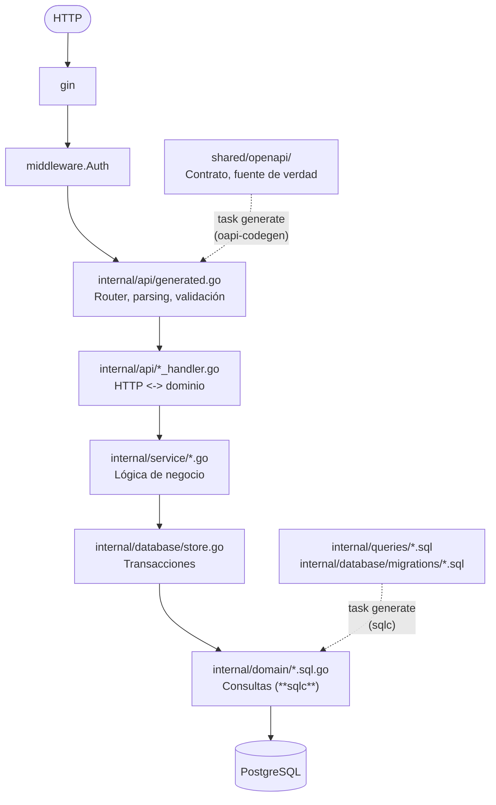

# Guía: cómo agregar un endpoint al backend

Esta guía explica, paso a paso, qué archivos tocar y qué comandos correr para agregar
una ruta nueva a la API. Todo el flujo parte del contrato OpenAPI: primero define el
endpoint en el contrato, luego genera el código y al final impleméntalo.

**Nota:** Toda la guía usa de ejemplo el agregar
`GET /v1/reportes/{reporteId}`, que devuelve un reporte por su id.

---

## Diagrama de arquitectura



Las flechas sólidas muestran el recorrido de una petición; las punteadas, el código que
genera `task generate`.

### Responsabilidad de cada capa

| Capa | Carpeta | Qué hace | Qué **no** hace |
|---|---|---|---|
| Contrato | `shared/openapi/` | Define rutas, parámetros, bodies y respuestas. Lo consumen backend, web y móvil. |- |
| Handlers | `internal/api/` | Lee el request ya validado, saca el `userID` del contexto, llama al servicio y traduce el resultado (o error de dominio) a un tipo de respuesta del contrato. | Lógica de negocio ni SQL. |
| Servicios | `internal/service/` | Aplica las reglas de negocio. Traduce errores de Postgres a errores de dominio (`domain.ErrX`). | No conoce HTTP ni los tipos de `api`. |
| Store | `internal/database/store.go` | Expone las consultas de **sqlc** y agrega operaciones de varias sentencias dentro de una transacción (`execTx`). | Reglas de negocio. |
| Dominio | `internal/domain/` | Contiene los modelos y consultas que genera **sqlc**, más archivos escritos a mano (`errors.go`, `reporte.go`, `user.go`). |- |
| Queries | `internal/queries/*.sql` | Contiene el SQL anotado para **sqlc**. |- |
| Migraciones | `internal/database/migrations/` | Define el esquema de la base. **sqlc** también las lee para conocer las tablas. |- |

### Archivos generados

| Archivo | Lo genera | A partir de |
|---|---|---|
| `internal/api/generated.go` | **oapi-codegen** | `shared/openapi/openapi.yaml` |
| `internal/domain/models.go`, `db.go`, `querier.go`, `*.sql.go` | **sqlc** | `internal/queries/*.sql` + migraciones |

No edites estos archivos a mano. En `internal/domain/` conviven archivos generados y
escritos a mano; los escritos a mano (`errors.go`, `reporte.go`, `user.go`) llevan un
comentario al inicio que lo indica, y **sqlc** no los toca.

---

## Requisitos

- Go (la versión de `go.mod`).
- [Task](https://taskfile.dev/installation/) para correr los comandos del `Taskfile.yml`.
- [sqlc](https://docs.sqlc.dev/en/latest/overview/install.html).
- [golang-migrate](https://github.com/golang-migrate/migrate/tree/master/cmd/migrate) (`migrate`).
- `oapi-codegen` no se instala aparte: está fijado como `tool` en `go.mod` y se ejecuta
  con `go tool oapi-codegen` (el `Taskfile` ya lo hace así).

Corre todos los comandos `task` desde la carpeta `backend/`.

---

## Guía paso a paso

### Resumen

| # | Paso | Archivo(s) |
|---|---|---|
| 1 | Crea la migración de esquema (si hace falta) | `internal/database/migrations/NNN_nombre.{up,down}.sql` |
| 2 | Define el endpoint en el contrato | `shared/openapi/paths/*.yaml`, `shared/openapi/schemas/**`, `shared/openapi/openapi.yaml` |
| 3 | Escribe la consulta SQL | `internal/queries/<recurso>.sql` |
| 4 | Genera el código | `task generate` |
| 5 | Agrega la operación transaccional (si hace falta) | `internal/database/store.go` |
| 6 | Implementa la lógica en el servicio | `internal/service/<recurso>.go` |
| 7 | Expón el método en la interfaz del handler | `internal/api/api.go` |
| 8 | Implementa el handler | `internal/api/<recurso>_handler.go` |
| 9 | Cablea el servicio (solo si es nuevo) | `cmd/api/main.go` |
| 10 | Escribe los tests y verifica | `internal/service/<recurso>_test.go`, `task test` |
| 11 | Regenera los tipos del frontend | `pnpm generate:types` (desde la raíz) |

### Paso 1: Crea la migración (solo si cambia el esquema)

Si el endpoint necesita una tabla o columna nueva, crea un par de archivos con el
siguiente número de la secuencia:

```
internal/database/migrations/005_agregar_algo.up.sql
internal/database/migrations/005_agregar_algo.down.sql
```

- `up` aplica el cambio; `down` lo revierte **exactamente** (una migración sin `down`
  correcto no se puede deshacer).
- Nunca edites una migración que ya está aplicada en otro entorno: crea una nueva.

Aplica o revierte las migraciones con:

```sh
task migrate-up                                    # usa DATABASE_URL o el valor por defecto
task migrate-up DATABASE_URL="postgres://..."      # contra otra base
task migrate-down                                  # revierte la última
```

> El ejemplo (`GET /reportes/{reporteId}`) no necesita migración: la tabla `reporte`
> ya existe.

### Paso 2: Define el endpoint en el contrato OpenAPI

El contrato está partido en tres niveles:

```
shared/openapi/
├── openapi.yaml               # índice: lista de paths y de components.schemas
├── paths/<recurso>.yaml       # operaciones agrupadas por recurso
└── schemas/<recurso>/*.yaml   # un archivo por schema
```

**2a. Crea los schemas nuevos (si hacen falta).** Crea un archivo por schema en
`schemas/<recurso>/`, con nombre en `snake_case`. Escribe también las propiedades del
JSON en `snake_case`; **oapi-codegen** las convierte a `CamelCase` en Go (`incidente_id` ->
`IncidenteId`). El ejemplo reutiliza `Reporte`, así que no necesita ninguno.

**2b. Agrega la operación** en `paths/reportes.yaml`. Cada clave de primer nivel del
archivo es un *path item* (todas las operaciones de una misma URL), y `openapi.yaml` la
referencia:

```yaml
obtenerReporte:
  get:
    operationId: obtenerReporte
    parameters:
      - name: reporteId
        in: path
        required: true
        schema:
          type: string
          format: uuid
    responses:
      '200':
        description: Reporte encontrado
        content:
          application/json:
            schema:
              $ref: '#/components/schemas/Reporte'
      '401':
        description: No autenticado
        content:
          application/json:
            schema:
              $ref: '#/components/schemas/ErrorResponse'
      '404':
        description: Reporte no encontrado
        content:
          application/json:
            schema:
              $ref: '#/components/schemas/ErrorResponse'
```

Convenciones y buenas prácticas:

- Escribe el **`operationId` en `camelCase` y en español** (`crearReporte`,
  `obtenerReporte`, `listarComentarios`). De él salen todos los nombres que se generan
  en Go (ver paso 4).
- Si el método va en una URL que **ya existe** (p. ej. `GET /reportes` junto al
  `POST /reportes`), agrégalo como otra clave (`get:`) dentro del mismo path item en
  vez de crear uno nuevo: una URL = un path item.
- Declara **todas** las respuestas que el handler puede devolver (incluidos los
  `4xx`). **oapi-codegen** solo genera tipos para las respuestas declaradas.
- Declara los ids como `type: string, format: uuid`; se mapean a `uuid.UUID` (el mismo
  tipo que usa **sqlc**, sin conversiones).
- Si agregas un schema nuevo, añádelo también al bloque `components.schemas` al final
  del archivo de path, para que el archivo se pueda resolver solo.

**Autenticación.** Por defecto **todas las rutas requieren token** (`security` global en
`openapi.yaml`). Para una ruta pública, pon `security: []` en la operación, como en
`paths/auth.yaml` (`register`, `login`). No toques el middleware: **oapi-codegen** marca las
rutas protegidas y `middleware.Auth` solo exige el header `Authorization: Bearer <jwt>`
en esas.

**2c. Registra la ruta en `openapi.yaml`.** Agrega la URL en `paths` y, si creas
schemas, agrégalos en `components.schemas`:

```yaml
paths:
  /reportes:
    $ref: './paths/reportes.yaml#/crearReporte'
  /reportes/{reporteId}:
    $ref: './paths/reportes.yaml#/obtenerReporte'
```

No incluyas `/v1` ni `/api` en las URLs del contrato: `main.go` agrega `/v1` (`BaseURL`)
y nginx quita `/api` antes de reenviar al backend.

### Paso 3: Escribe la consulta SQL

Escribe la consulta en `internal/queries/<recurso>.sql`, con la anotación de **sqlc**:

```sql
-- name: GetReporteByID :one
SELECT * FROM reporte WHERE id = $1;
```

| Anotación | Devuelve | Uso |
|---|---|---|
| `:one` | `(T, error)`; `pgx.ErrNoRows` si no hay fila | buscar uno |
| `:many` | `([]T, error)` | listados |
| `:exec` | `error` | `UPDATE`/`DELETE` sin retorno |

- Nombra las consultas en inglés y en `PascalCase`: `CreateX`, `GetXByID`, `ListXByY`,
  `UpdateX`, `DeleteX`.
- Para parámetros con nombre o casts, usa `sqlc.arg(nombre)`
  (ver `CreateLocation` en `reporte.sql`).
- Los tipos se mapean según `sqlc.yaml`: `uuid` -> `uuid.UUID`, `timestamptz` ->
  `time.Time`, columnas `NULL` -> punteros (`*string`, `*int`, `*time.Time`).

### Paso 4: Genera el código

```sh
task generate
```

Este comando corre `go tool oapi-codegen` (contrato -> `internal/api/generated.go`) y
`sqlc generate` (SQL -> `internal/domain/`). Después de esto el build **falla a
propósito**: `api.go` tiene la aserción `var _ StrictServerInterface = (*Server)(nil)` y
`Server` todavía no implementa el método nuevo. El error del compilador te dice qué falta.

Nombres que se generan a partir de `operationId: obtenerReporte`:

| Generado | Para qué |
|---|---|
| `ObtenerReporte(ctx, ObtenerReporteRequestObject) (ObtenerReporteResponseObject, error)` | método que implementa el handler |
| `ObtenerReporteRequestObject` | parámetros de path/query en campos (`ReporteId`) y el body en `.Body` |
| `ObtenerReporte200JSONResponse`, `ObtenerReporte404JSONResponse`, … | un tipo por cada respuesta declarada |

A partir de `-- name: GetReporteByID :one` se genera el método
`(*domain.Queries).GetReporteByID(ctx, id uuid.UUID) (domain.Reporte, error)`, que también
está disponible en `*database.Store` porque este embebe `*domain.Queries`.

### Paso 5: Agrega la operación al store (solo para operaciones de varias sentencias)

Si el endpoint escribe en más de una tabla y todo debe quedar o nada, agrega un método en
`internal/database/store.go` que use `execTx` (ver `CreateReporte` o
`CreateUserWithLocalProvider`). Si necesita un struct de parámetros propio, defínelo en un
archivo escrito a mano de `internal/domain/` (p. ej. `CreateReporteTxParams` en
`reporte.go`) con un nombre que no choque con los de **sqlc**.

Para una consulta simple, como la del ejemplo, omite este paso: el método generado ya
está disponible en el store.

### Paso 6: Implementa la lógica en el servicio

En `internal/service/reporte.go`:

1. Agrega el método del store a la interfaz **local** del servicio. Cada servicio declara
   solo lo que usa, con la firma exacta de **sqlc**; así `*database.Store` la satisface sin
   adaptadores y los tests pueden usar un falso:

   ```go
   type ReporteStore interface {
       CreateReporte(ctx context.Context, arg domain.CreateReporteTxParams) (domain.Reporte, error)
       GetReporteByID(ctx context.Context, id uuid.UUID) (domain.Reporte, error)
   }
   ```

2. Implementa el método de negocio y traduce los errores de Postgres a errores de dominio
   con los helpers de `domain/errors.go` (`domain.IsNotFound`, `domain.IsUniqueViolation`):

   ```go
   // Obtener devuelve el reporte con el id dado.
   func (s *ReporteService) Obtener(ctx context.Context, id uuid.UUID) (domain.Reporte, error) {
       r, err := s.store.GetReporteByID(ctx, id)
       if domain.IsNotFound(err) {
           return domain.Reporte{}, domain.ErrReporteNotFound
       }
       return r, err
   }
   ```

3. Si el error de dominio es nuevo, decláralo en `internal/domain/errors.go`:

   ```go
   ErrReporteNotFound = errors.New("reporte not found")
   ```

Nombra los métodos del servicio en español, con la acción que realizan (`Crear`,
`Obtener`, `Listar`); deja las consultas de **sqlc** en inglés.

### Paso 7: Expón el método en `api.go`

El paquete `api` no depende de los tipos concretos de `service`, sino de interfaces
declaradas en `internal/api/api.go`. Agrega ahí el método nuevo:

```go
type ReporteService interface {
    Crear(ctx context.Context, userID uuid.UUID, incidenteID int, latitude, longitude float64, imagePath *string) (domain.Reporte, error)
    Obtener(ctx context.Context, id uuid.UUID) (domain.Reporte, error)
}
```

### Paso 8: Implementa el handler

En `internal/api/<recurso>_handler.go` (aquí `reporte_handler.go`), implementa el método
generado sobre `*Server`:

```go
// ObtenerReporte devuelve un reporte por su id.
func (s *Server) ObtenerReporte(ctx context.Context, request ObtenerReporteRequestObject) (ObtenerReporteResponseObject, error) {
    r, err := s.services.Reportes.Obtener(ctx, request.ReporteId)
    if err != nil {
        if errors.Is(err, domain.ErrReporteNotFound) {
            return ObtenerReporte404JSONResponse{Message: "reporte no encontrado"}, nil
        }
        return nil, err
    }

    return ObtenerReporte200JSONResponse(toReporte(r)), nil
}
```

Reglas del handler:

- **Devuelve los errores esperados como un tipo de respuesta del contrato, con
  `err == nil`** (`ObtenerReporte404JSONResponse{...}, nil`). Así el cliente recibe el
  código y el mensaje correctos.
- **Devuelve los errores inesperados con `return nil, err`.** `main.go` los convierte en
  un `500` con `{"message": "internal server error"}` y registra el detalle en el log; el
  error real nunca llega al cliente.
- **Obtén el usuario autenticado** con `middleware.UserIDFromContext(ctx)` (solo en rutas
  protegidas). Si no está, devuelve `nil, errors.New("userID not found in context")`.
- El código generado rechaza con `400` los bodies con JSON inválido y los parámetros mal
  formados (p. ej. un `reporteId` que no es uuid) antes de llegar al handler. Pon en el
  handler las validaciones que el schema no expresa (longitudes en bytes, reglas
  cruzadas) y devuelve el `400` del contrato (ver `Register` en `auth_handler.go`).
- Convierte aquí `domain.X` al tipo del contrato. Si varios handlers usan la misma
  conversión, sácala a un helper `toX` (como `toAuthResponse`):

  ```go
  func toReporte(r domain.Reporte) Reporte {
      return Reporte{
          Id:            r.ID,
          IncidenteId:   r.IncidenteID,
          Avistamientos: r.Avistamientos,
          EsHistorico:   r.EsHistorico,
          EsOficial:     r.EsOficial,
          EstadoActual:  string(r.EstadoActual),
          CreatedAt:     r.CreatedAt,
          UpdatedAt:     r.UpdatedAt,
          ExpiredAt:     r.ExpiredAt,
      }
  }
  ```

### Paso 9: Cablea el servicio en `main.go` (solo para un recurso nuevo)

Si el endpoint usa un servicio que ya existe, omite este paso: la ruta se registra sola
con `api.RegisterHandlersWithOptions`.

Si creas un **servicio nuevo** (p. ej. `NotificacionService`):

1. Crea `internal/service/notificacion.go` con su interfaz `NotificacionStore`, el struct
   y `NewNotificacionService(store NotificacionStore)`.
2. En `internal/api/api.go`, agrega la interfaz `NotificacionService` y el campo
   `Notificaciones NotificacionService` en `Services`.
3. En `cmd/api/main.go`, construye el servicio con el `store` compartido y pásalo a
   `api.Services`:

   ```go
   notificaciones := service.NewNotificacionService(store)

   api.NewServer(api.Services{
       Comentarios:    comentarios,
       Reportes:       reportes,
       Auth:           auth,
       Notificaciones: notificaciones,
   })
   ```

Usa **un solo** `database.Store` para todos los servicios; no abras otro pool.

No registres rutas del contrato a mano con `r.GET(...)`: esas rutas no pasan por el
middleware de auth ni por la validación generada. Usa `r.GET` directo solo para rutas
fuera del contrato (`/health`, `/v1/openapi.json`).

### Paso 10: Escribe los tests y verifica

Agrega o actualiza `internal/service/<recurso>_test.go` con un falso en memoria del store.
Sigue las convenciones de [`internal/service/README.md`](internal/service/README.md);
en resumen: usa el mismo paquete, nombra las funciones `TestTipo_Comportamiento` y haz
que el falso devuelva los mismos errores que Postgres (`pgx.ErrNoRows`, `*pgconn.PgError`
con código `23505`).

Si agregas un método a la interfaz `ReporteStore`, **impleméntalo también en los falsos
existentes**; si no, el paquete de tests no compila.

Verifica con:

```sh
go build ./...        # confirma que Server implementa todo el contrato
go vet ./...
task test             # go test ./... -v
task run              # levanta la API en local
```

Prueba el endpoint a mano (con el backend en `localhost:8080`):

```sh
curl -H "Authorization: Bearer <token>" http://localhost:8080/v1/reportes/<uuid>
```

Obtén el token con `POST /v1/auth/login`. A través de nginx (Docker completo), usa la URL
`http://localhost/api/v1/...`.

### Paso 11: Regenera los tipos del frontend

El contrato también genera los tipos de TypeScript que usan web y móvil. Corre desde la
**raíz** del repo:

```sh
pnpm generate:types   # escribe shared/types/api-types.ts
```

---

## Comandos de referencia

Desde `backend/`:

| Comando | Qué hace |
|---|---|
| `task generate` | Regenera `internal/api/generated.go` e `internal/domain/` |
| `task generate-check` | Regenera y falla si hay diferencias con lo commiteado |
| `task migrate-up` / `task migrate-down` | Aplica / revierte migraciones |
| `task test` | Corre todos los tests |
| `task run` | Levanta la API |
| `go build ./...` | Verifica que el contrato esté implementado completo |

Desde la raíz: `pnpm generate:types`.

---

## Problemas comunes

| Síntoma | Causa probable |
|---|---|
| `*Server does not implement StrictServerInterface` | Falta implementar el handler del `operationId` nuevo, o la firma no coincide. |
| `401 missing Authorization header` en una ruta que debería ser pública | Falta `security: []` en la operación. |
| `UserIDFromContext` devuelve `false` en una ruta protegida | Falta `r.ContextWithFallback = true` en `main.go`. |
| El schema nuevo no aparece como tipo con nombre en Go | No está listado en `components.schemas` de `openapi.yaml`. |
| **sqlc** no encuentra una tabla o columna | Falta la migración, o tiene un error de sintaxis (**sqlc** lee las migraciones como esquema). |
| Los tests de `service` no compilan | La interfaz del store tiene un método que el falso no implementa. |
| `404` en una ruta que sí está en el contrato | La URL de la petición no lleva `/v1`, o falta correr `task generate`. |
